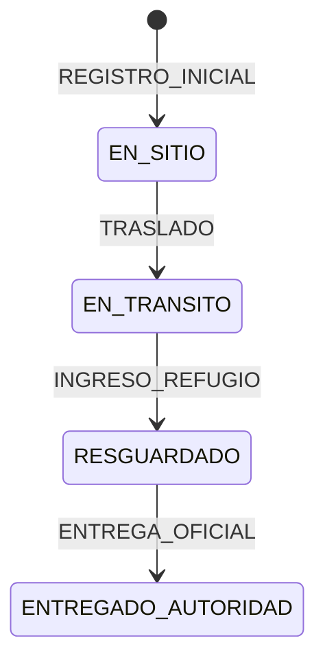

# API — Catálogos normalizados

Estados, roles y enums del sistema expuestos de forma **centralizada** para frontend, PWA y Postman. La fuente de verdad en backend sigue siendo `src/constants/index.js`; los metadatos legibles (etiquetas, descripciones) viven en `src/constants/catalog.definitions.js`.

**No requiere autenticación** (público, como `/api/geo`).

> Índice general de todos los endpoints: [API-ENDPOINTS.md](./API-ENDPOINTS.md)

## Endpoints

| Método | Ruta | Descripción |
|--------|------|-------------|
| `GET` | `/api/catalog` | Índice de dominios disponibles |
| `GET` | `/api/catalog/all` | Todos los catálogos en una respuesta |
| `GET` | `/api/catalog/:key` | Un catálogo por clave |

## Claves disponibles (`:key`)

| Clave | Campo en API | Ejemplo de valor |
|-------|--------------|------------------|
| `nna-status` | `statusActual` | `EN_SITIO` |
| `timeline-events` | `timeline.tipoEvent` | `TRASLADO` |
| `estado-salud` | `timeline.estadoSalud` | `ESTABLE` |
| `roles` | `user.rol` | `RESCATISTA_CIVIL` |
| `account-status` | `user.estadoCuenta` | `ACTIVO` |
| `institution-types` | `institution.tipo` | `PROTECCION_CIVIL` |
| `entidad-atencion-types` | `entidadAtencion.tipo` | `REFUGIO_OFICIAL` |
| `edad-aparente` | `datosNna.edadAparente` | `ADOLESCENTE` |
| `sexo-nna` | `datosNna.sexo` | `F` |

---

## GET /api/catalog

Respuesta **200**:

```json
{
  "success": true,
  "data": {
    "module": "catalog",
    "routes": {
      "domains": "GET /api/catalog",
      "full": "GET /api/catalog/all",
      "byKey": "GET /api/catalog/:key"
    },
    "count": 9,
    "domains": [
      {
        "key": "nna-status",
        "name": "Estados operativos del NNA",
        "field": "statusActual",
        "itemCount": 4
      }
    ]
  }
}
```

---

## GET /api/catalog/nna-status

Estados operativos del NNA (`statusActual`).

Respuesta **200**:

```json
{
  "success": true,
  "data": {
    "catalog": {
      "key": "nna-status",
      "name": "Estados operativos del NNA",
      "field": "statusActual",
      "items": [
        {
          "code": "EN_SITIO",
          "label": "En sitio de hallazgo",
          "description": "NNA registrado en el lugar del rescate. Estado inicial tras el alta.",
          "order": 1
        },
        {
          "code": "EN_TRANSITO",
          "label": "En tránsito",
          "description": "NNA en movimiento hacia un destino institucional autorizado.",
          "order": 2
        },
        {
          "code": "RESGUARDADO",
          "label": "Resguardado",
          "description": "NNA en refugio o entidad de atención oficial.",
          "order": 3
        },
        {
          "code": "ENTREGADO_AUTORIDAD",
          "label": "Entregado a autoridad",
          "description": "Cierre legal completado ante CPNNA u autoridad competente.",
          "order": 4
        }
      ],
      "transitions": [
        { "eventType": "TRASLADO", "statusCode": "EN_TRANSITO" },
        { "eventType": "INGRESO_REFUGIO", "statusCode": "RESGUARDADO" },
        { "eventType": "ENTREGA_OFICIAL", "statusCode": "ENTREGADO_AUTORIDAD" }
      ]
    }
  }
}
```

### Flujo de estados



> `ATENCION_MEDICA` no cambia `statusActual`; solo documenta salud en timeline.

---

## GET /api/catalog/all

Devuelve los 9 dominios completos. Útil para cachear en la PWA al iniciar.

---

## Errores

| Código | Caso |
|--------|------|
| **404** | Clave `:key` inexistente |
| **400** | Clave con formato inválido (validación Zod) |

Ejemplo **404**:

```json
{
  "success": false,
  "message": "Catálogo no encontrado: foo"
}
```

---

## Uso recomendado en frontend

1. Al arrancar la app: `GET /api/catalog/all` → guardar en estado global o IndexedDB.
2. Para selects/filtros: usar `items[].code` como valor y `items[].label` como texto visible.
3. Para badges de `statusActual`: mapear con el catálogo `nna-status`.
4. **No hardcodear** strings como `"EN_SITIO"` en el front; importarlos del catálogo o de constantes compartidas si existen.

## Mantenimiento

Al agregar un nuevo estado o enum:

1. Añadir en `src/constants/index.js` (validación Mongoose/Zod).
2. Registrar metadatos en `src/constants/catalog.definitions.js`.
3. Los tests en `tests/unit/constants/` y `tests/unit/services/catalog.service.test.js` deben seguir pasando.
