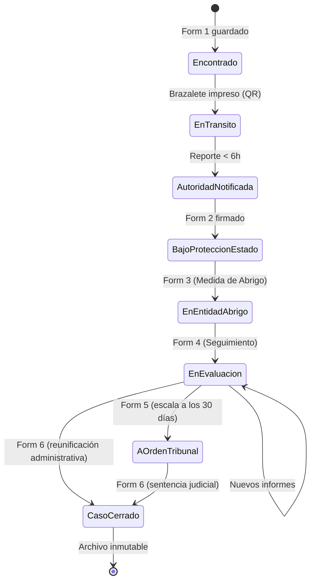
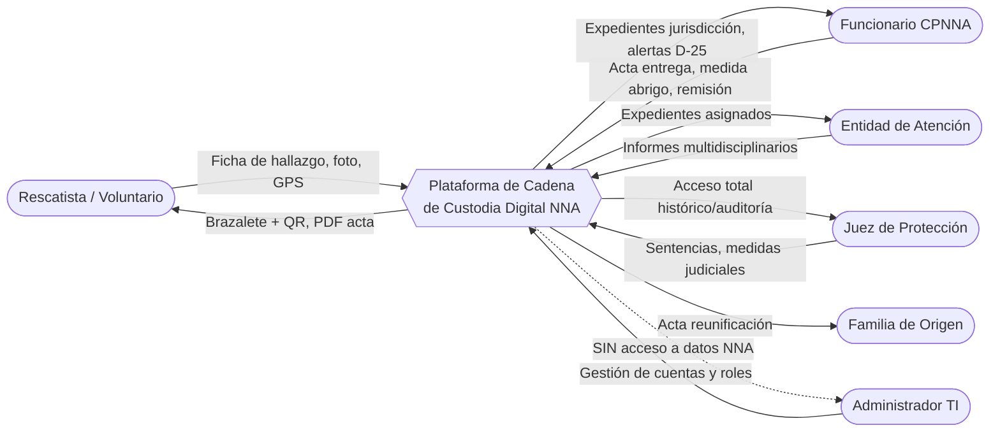
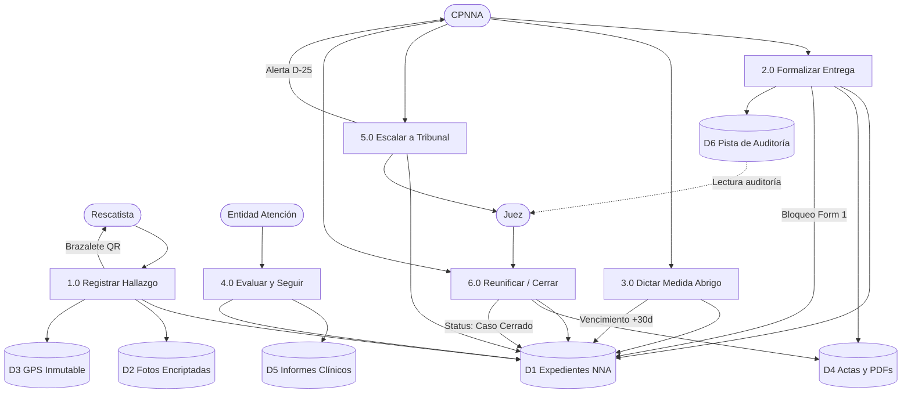
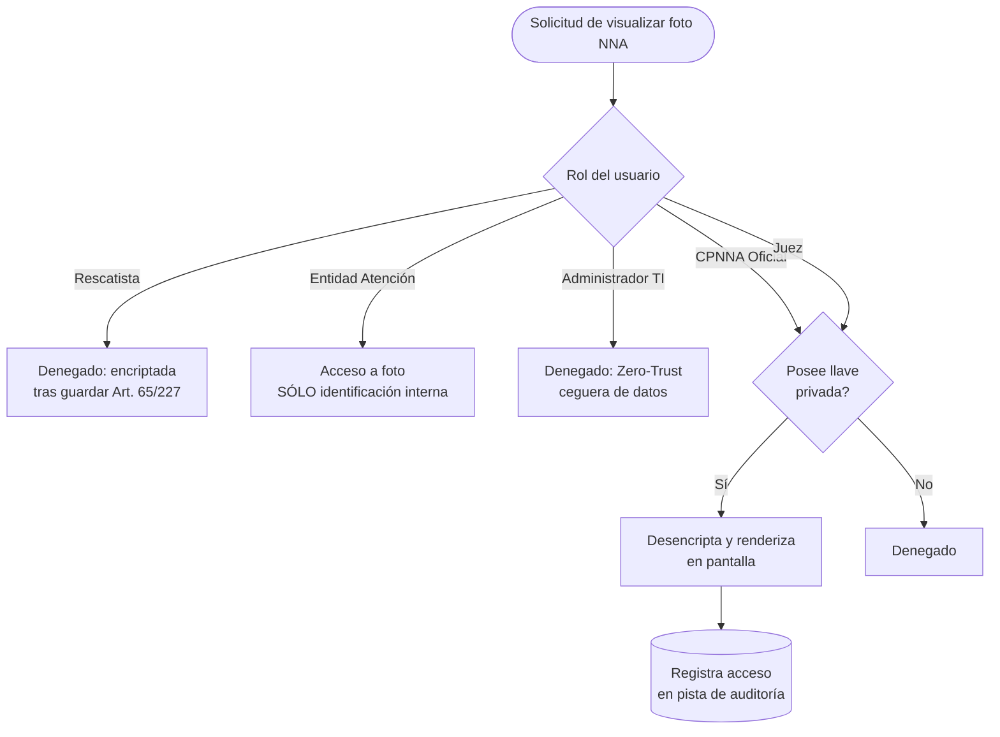
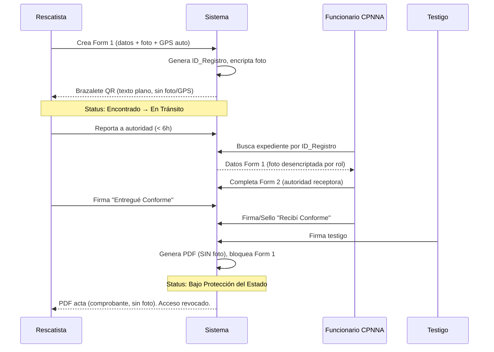

# ESPECIFICACIÓN DE REQUERIMIENTOS DE SOFTWARE (ERS)

## Plataforma de Cadena de Custodia Digital para NNA — Módulo de Captura de Datos

| Atributo                          | Valor                                                                                                                                    |
| --------------------------------- | ---------------------------------------------------------------------------------------------------------------------------------------- |
| **Documento**               | Requerimientos detallados de captura de datos                                                                                            |
| **Versión**                | 1.0 (Consolidado a partir de Especificaciones V3.0)                                                                                      |
| **Fecha**                   | 27/06/2026                                                                                                                               |
| **Marco legal rector**      | LOPNNA (Ley Orgánica para la Protección de Niños, Niñas y Adolescentes)                                                              |
| **Ámbito**                 | Trazabilidad de NNA rescatados en desastres sísmicos — registro, custodia, abrigo, seguimiento, escalamiento judicial y reunificación |
| **Estándar de referencia** | IEEE 830 / ISO-IEC-IEEE 29148                                                                                                            |
| **Autores**                 | Jose Carlos Chacon, Luis Eduardo Chacon, Alexander Moreno                                                                                |

---

## 1. INTRODUCCIÓN

### 1.1. Propósito

Este documento especifica, de forma detallada y verificable, los requerimientos de **captura de datos** de la plataforma. Define para cada formulario: campos, tipos de dato, reglas de validación, reglas de negocio, controles legales y comportamiento de interfaz. Sirve de contrato funcional entre las áreas legal/operativa y el equipo de desarrollo.

### 1.2. Alcance

El módulo cubre el ciclo de vida completo (lifecycle) del expediente digital de un NNA, desde el **hallazgo en zona cero** hasta el **cierre del caso** (reunificación, colocación o adopción), a través de seis (6) formularios encadenados que conectan a Rescatistas, CPNNA, Entidades de Atención, Jueces y la familia de origen.

### 1.3. Definiciones clave

- **NNA:** Niño, Niña o Adolescente.
- **CPNNA:** Consejo de Protección de Niños, Niñas y Adolescentes. Único órgano administrativo facultado para recibir al NNA y asumir tutela del Estado.
- **Expediente:** Conjunto inmutable de registros vinculados por una llave única (`ID_Registro`).
- **Documento Público:** Carácter legal de los datos capturados; su alteración u omisión constituye delito de **Falsedad Ideológica**.
- **Medida de Abrigo:** Medida administrativa transitoria, máximo **30 días**, antes de intervención judicial obligatoria.

### 1.4. Principios técnico-legales transversales (aplican a TODOS los formularios)

| #    | Principio                                        | Requerimiento técnico                                                                                                                                                                     |
| ---- | ------------------------------------------------ | ------------------------------------------------------------------------------------------------------------------------------------------------------------------------------------------ |
| P-01 | **Inmutabilidad del GPS**                  | Coordenadas capturadas en*background*; bloqueo absoluto de edición manual (carácter de Documento Público).                                                                            |
| P-02 | **Encriptación de fotografías**          | Almacenamiento en BD encriptada con llaves asimétricas (Art. 65 y 227 LOPNNA). La foto**nunca** se imprime en brazalete, ni se muestra en pantalla de confirmación del rescatista. |
| P-03 | **Cero borrado**                           | `DELETE = FALSE` para todos los roles. Registro inmutable.                                                                                                                               |
| P-04 | **Bloqueo de edición**                    | Formulario 1 pasa a sólo-lectura al firmarse el Formulario 2. Correcciones posteriores sólo vía "Nota al Expediente" con pista de auditoría.                                           |
| P-05 | **Pista de auditoría**                    | Toda operación de escritura registra quién, cuándo, qué y por qué (audit trail inalterable).                                                                                          |
| P-06 | **Prohibición de traslados particulares** | El sistema bloquea cualquier ruta de custodia hacia residencias particulares o fundaciones no certificadas (sustracción de menores).                                                      |
| P-07 | **Ceguera de datos para TI**               | El Administrador no puede visualizar nombres, fotos, edades ni GPS de NNA (Zero-Trust de datos sensibles).                                                                                 |

---

## 2. MODELO DE ESTADOS DEL EXPEDIENTE (Status Maestro)

/1782605750390.png)

## 3. ESPECIFICACIÓN DETALLADA POR FORMULARIO

### Convenciones de la especificación

- **Tipo:** tipo de dato técnico.
- **Oblig.:** R = Requerido · O = Opcional · C = Condicional · A = Autogenerado.
- **Edit.:** indica editabilidad tras guardado.

---

### 3.1. FORMULARIO 1 — Ficha de Registro de Hallazgo

**Interfaz:** Móvil (PWA/App offline-capable) · **Actor:** Rescatista / Voluntario · **Punto de entrada del NNA al sistema.**

#### Bloque 1.1 — Sistema y Geolocalización (Autogenerado · No editable)

| Campo                        | Tipo                  | Oblig. | Validación / Regla de negocio                                                                                      | Edit. |
| ---------------------------- | --------------------- | ------ | ------------------------------------------------------------------------------------------------------------------- | ----- |
| `ID_Registro`              | String                | A/R    | Formato`[ESTADO]-[MUNICIPIO]-[FECHA]-[NÚMERO]` (ej. `DC-CCS-260626-001`). Llave primaria única e irrepetible. | No    |
| `Timestamp_Creacion`       | Datetime              | A/R    | Sello automático del servidor.                                                                                     | No    |
| `GPS_Coordenadas_Hallazgo` | Geolocation (Lat/Lon) | A/R    | Captura automática en background.**Inmutable** tras guardar (P-01).                                          | No    |

#### Bloque 1.2 — Datos del Rescatista o Interviniente

| Campo                        | Tipo                  | Oblig. | Validación                              |
| ---------------------------- | --------------------- | ------ | ---------------------------------------- |
| `Nombre_Rescatista`        | String                | R      | No vacío.                               |
| `Cedula_Rescatista`        | Alfanumérico (V-/E-) | R      | Prefijo válido`V-`/`E-` + dígitos. |
| `Telefono_Contacto`        | Numérico             | R      | Formato telefónico válido.             |
| `Institucion_Organizacion` | String                | R      | No vacío.                               |

#### Bloque 1.3 — Datos del NNA Hallado

| Campo                           | Tipo       | Oblig. | Validación / Regla                                                                                                                                                                           |
| ------------------------------- | ---------- | ------ | --------------------------------------------------------------------------------------------------------------------------------------------------------------------------------------------- |
| `Fecha_Hora_Hallazgo`         | Datetime   | R      | No futura.                                                                                                                                                                                    |
| `Lugar_Exacto_Hallazgo_Texto` | Text Area  | R      | Referencia física complementaria al GPS.                                                                                                                                                     |
| `Fotografia_NNA_Confidencial` | File/Image | O      | Encriptación inmediata (P-02). UI muestra advertencia legal:*"Uso estrictamente confidencial para reunificación familiar por el CPNNA. Prohibida su difusión externa (Art. 65 LOPNNA)"*. |
| `Nombre_NNA`                  | String     | O      | —                                                                                                                                                                                            |
| `Edad_Aparente`               | Enum       | R      | {Lactante, Preescolar, Escolar, Adolescente}.                                                                                                                                                 |
| `Edad_Declarada_por_NNA`      | Numérico  | O      | Rango 0–17.                                                                                                                                                                                  |
| `Sexo`                        | Enum       | R      | {F, M}.                                                                                                                                                                                       |
| `Estado_Salud`                | Enum       | R      | {Estable, Requiere atención médica urgente, Con lesiones visibles}.                                                                                                                         |
| `Rasgos_Identificativos`      | Text Area  | R      | Señas particulares / condición física.                                                                                                                                                     |
| `Validacion_Art80`            | Boolean    | R      | Pregunta:*"¿Fue escuchado? (Art. 80 LOPNNA)"*.                                                                                                                                             |
| `Observaciones_del_NNA`       | Text Area  | C      | **Requerido si** `Validacion_Art80 = Sí`.                                                                                                                                            |

#### Acción de cierre F1 — Generación de código de brazalete

- Al guardar, genera vista en **texto plano de alto contraste** que contiene **únicamente**: `ID_Registro`, `Nombre_Rescatista`, `Telefono_Contacto` (transcripción manual al brazalete físico).
- Genera **brazalete imprimible** con Código QR que enlaza a la ficha completa.
- **La fotografía y el GPS se ocultan automáticamente** tras el guardado (P-02).
- **Trigger de estado:** `Encontrado` → `En Tránsito`. Se habilita el reporte a la autoridad (SLA < 6 horas).

---

### 3.2. FORMULARIO 2 — Acta de Entrega Provisional

**Interfaz:** Web/Tablet · **Actor:** Funcionario CPNNA (co-firma Rescatista + Testigo) · **Traspaso de custodia al Estado.**

#### Bloque 2.1 — Búsqueda, Validación y Contexto

| Campo                       | Tipo                           | Oblig. | Validación / Regla                                                                                      |
| --------------------------- | ------------------------------ | ------ | -------------------------------------------------------------------------------------------------------- |
| `Buscador_Expediente`     | Input Search (`ID_Registro`) | R      | Auto-pobla datos del Form 1 (sólo lectura). La foto sólo se desencripta si el rol es`CPNNA_Oficial`. |
| `Ciudad_Entrega`          | String                         | R      | —                                                                                                       |
| `Estado_Entrega`          | String                         | R      | —                                                                                                       |
| `Lugar_Actuacion` (Sede)  | String                         | R      | —                                                                                                       |
| `GPS_Coordenadas_Entrega` | Geolocation                    | A/R    | Captura automática. Punto exacto donde el Estado asume tutela. Inmutable.                               |

#### Bloque 2.2 — Autoridad que Recibe (Exclusivo CPNNA)

| Campo                    | Tipo          | Oblig. |
| ------------------------ | ------------- | ------ |
| `Municipio_CPNNA`      | String        | R      |
| `Funcionario_Receptor` | String        | R      |
| `Cedula_Funcionario`   | Alfanumérico | R      |
| `Cargo`                | String        | R      |

#### Bloque 2.3 — Cierre, Legalidad y Firmas

| Campo                        | Tipo                         | Oblig. | Regla                                                                                         |
| ---------------------------- | ---------------------------- | ------ | --------------------------------------------------------------------------------------------- |
| `Fundamentacion_Legal`     | Texto estático autogenerado | A      | Inyecta Arts. 15, 16, 126, 158, 160, 401 LOPNNA + advertencia penal por Falsedad Ideológica. |
| `Firma_Huella_Rescatista`  | Canvas/Biométrico           | R      | Etiqueta:*"Entregué Conforme"*.                                                            |
| `Firma_Huella_Sello_CPNNA` | Canvas/Biométrico           | R      | Etiqueta:*"Recibí Conforme (CPNNA)"*.                                                      |
| `Datos_y_Firma_Testigo`    | String + Canvas              | R      | Identificación + firma del testigo.                                                          |

#### Acción de cierre F2 — Generación de PDF legal

- Genera PDF "Acta de Entrega Provisional" uniendo datos de Form 1 + Form 2.
- **Condición crítica:** el PDF **NO** incluye la fotografía del NNA, salvo botón de anulación con orden judicial (Art. 227 LOPNNA).
- **Bloqueo:** Form 1 pasa a **sólo-lectura** (P-04). El rescatista **pierde acceso total** al expediente; conserva sólo el PDF (sin foto).
- **Trigger de estado:** → `Bajo Protección del Estado`.

---

### 3.3. FORMULARIO 3 — Resolución de Medida de Abrigo

**Interfaz:** Web · **Escritura:** Funcionario CPNNA · **Lectura:** CPNNA, Entidad de Atención receptora, Juez · **Asignación a Entidad de Atención.**

| Campo                            | Tipo                    | Oblig. | Validación / Regla                                                                                                    |
| -------------------------------- | ----------------------- | ------ | ---------------------------------------------------------------------------------------------------------------------- |
| `Buscador_Expediente`          | Input (`ID_Registro`) | R      | Auto-pobla datos.                                                                                                      |
| `Entidad_de_Atencion_Asignada` | Dropdown                | R      | Alimentado por catálogo de entidades**certificadas** (P-06).                                                    |
| `Funcionario_Receptor_Entidad` | String                  | R      | Director/trabajador social que recibe físicamente.                                                                    |
| `Condiciones_Medicas_Ingreso`  | Text Area               | R      | Contrasta estado de salud al ingreso vs. al rescate.                                                                   |
| `Fecha_Vencimiento_Abrigo`     | Datetime                | A/R    | **Autocalculado: fecha emisión + máx. 30 días.** La ley prohíbe exceder el plazo sin intervención judicial. |

- **Trigger de estado:** → `En Entidad de Abrigo`.
- **Trigger temporal:** programa alerta de dashboard para el **día 25** (ver Form 5).

---

### 3.4. FORMULARIO 4 — Informe de Evaluación y Seguimiento Multidisciplinario

**Interfaz:** Web · **Escritura:** Personal de Entidad de Atención (Trabajador Social, Psicólogo, Médico) · **Lectura:** Entidad, CPNNA, Juez · **Bitácora clínica/psicológica.**

| Campo                         | Tipo        | Oblig. | Validación / Regla                                                        |
| ----------------------------- | ----------- | ------ | -------------------------------------------------------------------------- |
| `ID_Registro`               | FK          | R      | Llave foránea al expediente.                                              |
| `Tipo_Evaluacion`           | Dropdown    | R      | {Médica, Psicológica, Trabajo Social, Legal}.                            |
| `Fecha_Evaluacion`          | Datetime    | R      | No futura.                                                                 |
| `Diagnostico_Observaciones` | Text Area   | R      | Documenta nombres recordados, dirección, condiciones médicas, etc.       |
| `Adjuntos_Clinicos`         | File Upload | O      | Radiografías, récipes, informes forenses (acceso altamente restringido). |

- Es un formulario **N veces** por expediente (histórico acumulativo, no sobrescribe).
- **Trigger de estado:** → `En Evaluación`.

---

### 3.5. FORMULARIO 5 — Remisión a Tribunal de Protección (Escalamiento Judicial)

**Interfaz:** Web · **Escritura:** Funcionario CPNNA · **Lectura:** Juez, CPNNA · **Escalamiento por vencimiento de los 30 días.**

| Campo                   | Tipo      | Oblig. | Validación / Regla                                                                                      |
| ----------------------- | --------- | ------ | -------------------------------------------------------------------------------------------------------- |
| `ID_Registro`         | FK        | R      | —                                                                                                       |
| `Tribunal_Asignado`   | Dropdown  | R      | Tribunal de Protección de la jurisdicción.                                                             |
| `Motivo_Remision`     | Dropdown  | R      | {Vencimiento lapso 30 días, Necesidad de Colocación Familiar, Presunción de Abandono/Orfandad Total}. |
| `Resumen_Actuaciones` | Text Area | R      | Gestiones del CPNNA para localizar a la familia.                                                         |

- **Lógica de negocio (trigger del sistema):** alerta visual en dashboard del CPNNA el **día 25** de la medida de abrigo.
- **Acción de cierre:** la potestad pasa al Tribunal; CPNNA queda en rol de acompañamiento; Juez asume control jurisdiccional.
- **Trigger de estado:** → `A la orden del Tribunal`.

---

### 3.6. FORMULARIO 6 — Acta de Reunificación Familiar / Cierre de Caso

**Interfaz:** Web · **Escritura:** Funcionario CPNNA o Juez · **Lectura tras cierre:** archivo inmutable (consulta) · **Cierre exitoso de la cadena.**

| Campo                             | Tipo           | Oblig. | Validación / Regla                                                                      |
| --------------------------------- | -------------- | ------ | ---------------------------------------------------------------------------------------- |
| `Nombre_Familiar_Receptor`      | String         | R      | —                                                                                       |
| `Cedula_Familiar`               | Alfanumérico  | R      | —                                                                                       |
| `Parentesco_Comprobado`         | Dropdown       | R      | {Madre, Padre, Abuelo/a, Tío/a, Hermano/a mayor} — hasta 4.º grado de consanguinidad. |
| `Metodo_Comprobacion_Filiacion` | Dropdown/Text  | R      | {Partida de Nacimiento, Prueba de ADN, Reconocimiento certificado por psicólogo}.       |
| `Firma_Biometrica_Familiar`     | Canvas         | R      | Asienta legalmente la recepción.                                                        |
| `Autoridad_Que_Entrega`         | String + Firma | R      | Juez o Consejero que autoriza la salida.                                                 |

- **Acción de cierre:** Status Maestro → **"Caso Cerrado - Reunificado"**. Todos los roles previos pierden acceso activo; el expediente queda en **archivo inmutable**.

---

## 4. DIAGRAMAS DE FLUJO DE DATOS (DFD)

### 4.1. DFD Nivel 0 — Diagrama de Contexto

/1782603369317.png)

### 4.2. DFD Nivel 1 — Procesos principales y almacenes de datos

/1782603390831.png)

### 4.3. Flujo de control de acceso a la fotografía (dato sensible)

/1782603417789.png)

### 4.4. Diagrama de secuencia — Traspaso de custodia (Form 1 → Form 2)

---

## 5. MATRIZ DE ROLES Y CONTROL DE ACCESO (RBAC)

### 5.1. Roles del sistema

| ID    | Rol                                             | Descripción                                                       | Acceso a Foto                  | Acceso a GPS                        |
| ----- | ----------------------------------------------- | ------------------------------------------------------------------ | ------------------------------ | ----------------------------------- |
| ROL-1 | **Rescatista / Voluntario**               | Primer interviniente, depositario provisional. Acceso transitorio. | Captura,**no visualiza** | Captura auto,**no visualiza** |
| ROL-2 | **Funcionario CPNNA / Protección Civil** | Única autoridad receptora administrativa (Arts. 158/160).         | **Desencripta (llave)**  | **Visualiza**                 |
| ROL-3 | **Representante de Entidad de Atención** | Custodia institucional temporal (≤30 días).                      | Foto (identificación interna) | **No accede**                 |
| ROL-4 | **Juez de Tribunal de Protección**       | Máxima autoridad judicial. Decide destino final.                  | **Desencripta (llave)**  | **Visualiza**                 |
| ROL-5 | **Administrador de Sistema / TI**         | Mantenimiento técnico y gestión de cuentas.                      | **Ceguera total**        | **Ceguera total**             |

### 5.2. Matriz de acceso por FORMULARIO (C=Crear, R=Leer, U=Actualizar, D=Borrar)

| Formulario                              | ROL-1 Rescatista | ROL-2 CPNNA       | ROL-3 Entidad | ROL-4 Juez | ROL-5 Admin TI |
| --------------------------------------- | ---------------- | ----------------- | ------------- | ---------- | -------------- |
| **F1 — Ficha de Hallazgo**       | C, R¹           | R (jurisdicción) | —            | R          | —             |
| **F2 — Acta de Entrega**         | R/Firma          | C, R, Firma       | —            | R          | —             |
| **F3 — Medida de Abrigo**        | —               | C, R              | R²           | R          | —             |
| **F4 — Evaluación/Seguimiento** | —               | R                 | C, R²        | R          | —             |
| **F5 — Remisión a Tribunal**    | —               | C, R              | —            | R          | —             |
| **F6 — Reunificación/Cierre**   | —               | C, R              | —            | C, R       | —             |
| **Pista de Auditoría**           | —               | R³               | R³           | R (total)  | —             |
| **Gestión de cuentas/roles**     | —               | —                | —            | —         | C, R, U        |

> ¹ Sólo expedientes propios y *activos* (no entregados). Pierde todo acceso al firmar F2.
> ² Sólo expedientes **asignados explícitamente** a su institución.
> ³ Lectura de auditoría limitada a sus propias actuaciones.
> **Nota global:** `D` (Borrado) = **FALSE para todos los roles** (P-03).

### 5.3. Matriz de acceso a DATOS SENSIBLES

| Dato sensible               | ROL-1                      | ROL-2          | ROL-3                  | ROL-4          | ROL-5    |
| --------------------------- | -------------------------- | -------------- | ---------------------- | -------------- | -------- |
| Nombre del NNA              | Escribe / no relee tras F2 | ✅ Lee         | ✅ Lee (asignados)     | ✅ Lee         | ❌ Ciego |
| Fotografía NNA             | Captura / ❌ no ve         | ✅ Desencripta | ⚠️ Sólo id. interna | ✅ Desencripta | ❌ Ciego |
| GPS Hallazgo/Entrega        | Captura / ❌ no ve         | ✅ Ve          | ❌ No accede           | ✅ Ve          | ❌ Ciego |
| Informes forenses/clínicos | ❌                         | ✅ Lee         | ✅ Escribe/Lee         | ✅ Lee         | ❌ Ciego |
| Edad / datos demográficos  | Escribe                    | ✅ Lee         | ✅ Lee                 | ✅ Lee         | ❌ Ciego |

### 5.4. Reglas de arquitectura de permisos (resumen para el equipo técnico)

1. **Delete = False** para todos los roles. Registro inmutable (Documento Público).
2. **Form 1 → Read-Only** en el instante en que se firma Form 2.
3. **BD fotográfica** con **llaves asimétricas**: sólo credenciales de ROL-2 (CPNNA) y ROL-4 (Juez) poseen la clave privada para renderizar imágenes.
4. **Correcciones del CPNNA** no editan el original: se asientan como **"Nota al Expediente"** con audit trail (quién/cuándo/por qué).
5. **Catálogo de Entidades:** sólo entidades certificadas son seleccionables (bloqueo de traslados particulares).

---

## 6. REQUERIMIENTOS NO FUNCIONALES DE LA CAPTURA

| ID     | Categoría                      | Requerimiento                                                                                                                                   |
| ------ | ------------------------------- | ----------------------------------------------------------------------------------------------------------------------------------------------- |
| RNF-01 | **Operación offline**    | El Formulario 1 debe capturarse sin conectividad (zona de desastre) y sincronizar al recuperar señal; el GPS y timestamp se sellan localmente. |
| RNF-02 | **Integridad**            | Validación en cliente y servidor; rechazo de registros con campos requeridos vacíos.                                                          |
| RNF-03 | **Seguridad**             | Encriptación en reposo y tránsito (TLS); llaves asimétricas para fotos; control de acceso por rol en cada endpoint.                          |
| RNF-04 | **Auditoría**            | Toda escritura genera entrada inalterable de auditoría (append-only).                                                                          |
| RNF-05 | **Disponibilidad**        | Tolerancia a fallos en sincronización; cola de reintentos para registros offline.                                                              |
| RNF-06 | **Usabilidad**            | UI de alto contraste para el brazalete; advertencias legales visibles en captura de foto.                                                       |
| RNF-07 | **Trazabilidad temporal** | Cálculo automático del vencimiento de 30 días y disparo de alerta en el día 25.                                                             |
| RNF-08 | **No repudio**            | Firmas biométricas/canvas vinculadas a identidad y timestamp.                                                                                  |

---

## 7. TRAZABILIDAD: PROCESO → FORMULARIO → ESTADO

| # | Proceso                 | Formulario | Actor (escritura)           | Estado resultante                   |
| - | ----------------------- | ---------- | --------------------------- | ----------------------------------- |
| 1 | Registro y Marcaje      | F1         | Rescatista                  | Encontrado / En Tránsito           |
| 2 | Acta de Entrega         | F2         | CPNNA (+Rescatista+Testigo) | Bajo Protección del Estado         |
| 3 | Medida de Abrigo        | F3         | CPNNA                       | En Entidad de Abrigo                |
| 4 | Seguimiento             | F4         | Entidad de Atención        | En Evaluación                      |
| 5 | Escalamiento (opcional) | F5         | CPNNA                       | A la orden del Tribunal             |
| 6 | Reunificación          | F6         | CPNNA o Juez                | Caso Cerrado (Reunificado/Adoptado) |

---

*Documento consolidado a partir de: "Child Protection Custody Chain Technical Specifications" (V3.0), "Guardian Registry: Digital Chain of Custody for Minors" y "Legal Custody and Access Control Matrix for NNA Platforms". Cumplimiento LOPNNA.*
